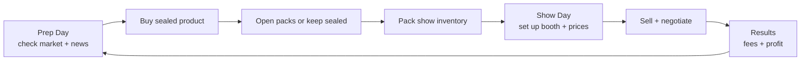
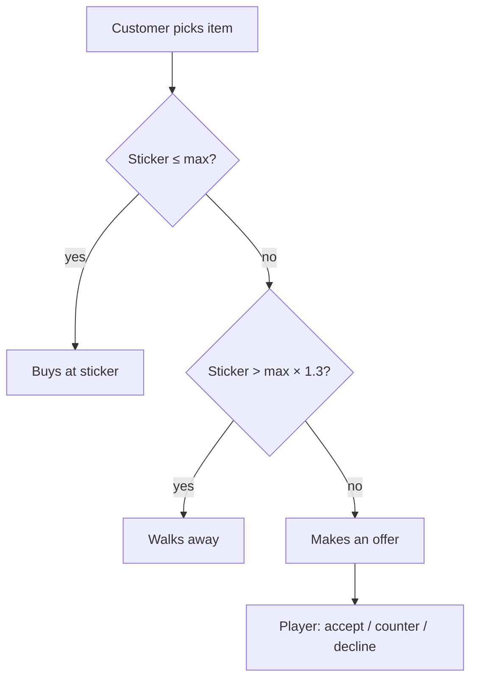

# TCG Card Show Simulator — v1 GDD

2026-09-17 · Christian
Living version: https://claude.ai/code/artifact/4be41c69-5b67-46bf-9b37-a5805e2ea626

## Overview

v1 is a solo, single-venue game that proves two things are fun: deciding whether to sell, hold or rip sealed product based on a moving market, and haggling with customers at the booth. Everything else waits until those two feel good.

**Pitch:** You're a new card vendor with $500 and a dream. Watch the market, buy sealed product, rip packs for chase cards, and work the table at weekend card shows to become the richest vendor in the scene.

**Player = the vendor.** The TCG is our own fictional game (working name: *Mythbound*), built to mirror real products: 10-card packs, 6-pack bundles and 36-pack booster boxes.

**What "simple" means for v1:** one venue, two card sets, three sealed products, three customer types, no grading, no card conditions, no co-op. A full run is 20 shows.

## Design pillars

Every v1 feature must serve at least one of these three pillars; anything that doesn't gets cut.

1. **Read the market.** Prices move daily for readable reasons. A player who pays attention should beat one who doesn't.
2. **Rip or hold.** Every sealed item is a real choice. Opening is a thrilling gamble with slightly negative expected value; holding or selling sealed is the steady play.
3. **Work the table.** Selling is a conversation, not a click. Price too high and people walk; cave too fast and you leave money behind.

## v1 scope

v1 ships the full Prep → Show → Results loop at its smallest honest size. Cut features are deferred, not dropped.

| Area | In v1 | Deferred to post-v1 |
| --- | --- | --- |
| Players | Solo | Co-op (shared empire, rival booths) |
| Card sets | 2 sets: one in print, one out of print | New set releases mid-run |
| Sealed products | Booster Pack, Booster Bundle (6), Booster Box (36) | Elite box, tins, collections |
| Singles | Near Mint only, raw only | Conditions, grading, slabs |
| Market | Lifecycle trend, daily noise, news events | Player sales affecting price, deeper sim |
| Venues | 1 local show, fixed table fee | Show tiers, travel, calendar choice |
| Customers | 3 archetypes that buy | Whales, players; customers selling to you |
| Booth | Fixed layout: display case, binder, sealed shelf | Upgrades, helpers, card reader |
| Progression | Net worth goal over 20 shows | Reputation, unlocks, leaderboards |
| Save | One save slot | Multiple slots, cloud |

## Core loop

One cycle is two in-game days: a Prep Day at home, then a Show Day at the venue. Market prices update at the start of each day, so they can shift between prep and show.

**Prep Day (untimed).** The player uses the home computer to read prices and news, buy product, and open packs. They then pick which items go in the show case, binder and sealed shelf.

**Show Day (timed, about 8 real minutes).** The player sets sticker prices, the doors open, and customers browse. Sales and negotiations happen until closing.

**Results.** Revenue minus table fee equals the day's profit. Unsold items return home. The run ends after show 20.

## Market system

Every card and sealed product has one market price per day, calculated from a base value and three multipliers. The player reads it on the home computer's *CardTrader* app.

**Formula:** `price(day) = basePrice × trend(day) × eventMult(day) × noise(day)`

- **trend** follows the set's lifecycle. The in-print set drifts slowly down (supply keeps growing). The out-of-print set drifts slowly up.
- **noise** is a daily random walk sized by volatility tier: Low ±1%, Medium ±3%, High ±8%. Commons are Low, chase cards are High.
- **eventMult** comes from news events, which fade back to 1.0 over a few days.

**News events (v1 set).** One event fires roughly every 3 days. Each appears in the news feed on the Prep Day before it moves prices, rewarding players who read it.

| Event | Target | Effect |
| --- | --- | --- |
| Influencer hype | One set's sealed product | +15–30%, fades over 4 days |
| Tournament win | 1–3 specific cards | +20–60%, fades over 5 days |
| Reprint announced | 1 chase card | −20–40%, permanent |
| Restock wave | In-print sealed | −10–15%, fades over 3 days |

**CardTrader app shows:** current price, 7-day change and a sparkline per item, the news feed, and a Rip EV figure per sealed product (expected pull value vs. sealed price). v1 shows Rip EV to everyone; hiding it behind an upgrade is a post-v1 idea.

The simulation uses a seeded RNG so runs can be replayed for debugging and balancing.

## Products and pack opening

v1 has 2 sets × 3 products = 6 sealed items, plus about 60 singles. That is enough for real market decisions without a content burden.

**Sets.** *Set A* is in print: cheaper, easy to buy, slowly declining. *Set B* is out of print: pricier, limited supplier stock each Prep Day, slowly rising. Each set has 30 cards.

| Rarity | Cards per set | Pack slot | Pull chance |
| --- | --- | --- | --- |
| Common | 12 | 6 per pack | Guaranteed |
| Uncommon | 9 | 3 per pack | Guaranteed |
| Rare | 5 | Rare slot | 82% |
| Ultra Rare | 3 | Rare slot | 15% |
| Secret Rare (chase) | 1 | Rare slot | 3% |

Each pack has 10 cards: 6 commons, 3 uncommons and 1 rare slot. Pull rates are identical across products, like real sealed product; bigger products just have more packs and a lower price per pack.

**Pack opening.** Cards flip one at a time, rare slot last, with a rarity glow and a slowdown on Ultra and Secret pulls. A "quick open" button skips the animation for bulk opening. Commons and uncommons go into a bulk box sold at a fixed price per card.

**Opening rule of thumb:** Rip EV should sit at 80–95% of the pack's market price, so opening is a slightly losing bet on average but events and hot cards can flip it positive.

## Inventory and booth setup

The booth has a fixed layout with three zones, and slot limits force the player to choose what to bring.

| Zone | Holds | Slots | Who it attracts |
| --- | --- | --- | --- |
| Display case | Ultra and Secret Rares | 6 | Collectors, Hagglers |
| Binder | Rares and up | 24 | Collectors, Hagglers |
| Sealed shelf | Packs, bundles, boxes | 8 stacks | Kids, Collectors |
| Bulk box | Commons, uncommons | Unlimited | Kids |

**Setting prices.** Each item gets a sticker price. The setup screen shows market price beside it, plus quick buttons for 90%, 100% and 110% of market. A "price all at X% of market" button keeps setup fast.

**Inventory.** One home inventory holds everything the player owns. Items placed in the booth travel to the show; unsold items come back automatically at Results.

## Customers and negotiation

Each customer secretly holds a maximum price for the item they pick up; the whole negotiation is the player trying to land close to it without losing the sale.

### Archetypes

| Archetype | Share of traffic | Wants | Max price (× market) | Patience (rounds) |
| --- | --- | --- | --- | --- |
| Kid + parent | 40% | Packs, bundles, bulk | 1.00–1.15 | 1 |
| Collector | 40% | Rares and up, boxes | 0.95–1.05 | 3 |
| Haggler / flipper | 20% | Anything under market | 0.75–0.88 | 4 |

A show has about 25 customers, arriving in waves. Each browses, picks one item they want, and compares the sticker to their max.

### Decision flow

### Negotiation rules

1. The customer's first offer is 80–90% of their max.
2. The player accepts, declines, or counters with a number.
3. A counter at or under their max is accepted. Above max, they raise their offer 30–50% of the gap toward max and lose one patience.
4. At zero patience they walk. A counter more than 25% above their last offer costs two patience ("that's insulting").
5. Hagglers may say a comp line ("I see it for $X online") where X is the real market price.

The negotiation UI shows the customer's offer, a mood icon for remaining patience, the item's market price and a number input for counters. No hidden reputation in v1.

## End of day and economy

The Results screen answers one question: did today make or lose money? It shows revenue, cost of goods sold, the table fee and net profit, plus the player's net worth.

**Results breakdown**

- **Revenue:** total of every sale today.
- **Cost of goods sold:** what the player paid for sold items (singles pulled from packs carry a share of the pack's cost).
- **Table fee:** flat $60, charged at the end of every show.
- **Net profit:** revenue − cost of goods sold − table fee.
- **Net worth:** cash + inventory at today's market price.

**Win condition.** The run ends after show 20, and the final screen grades net worth (Bronze $2,500, Silver $5,000, Gold $10,000) so every run ends with a score.

**Lose condition.** Bankrupt if the player can't pay the table fee and owns no inventory. Otherwise, unpaid fees are taken from inventory at 70% of market.

## Screens and UI flow

v1 needs seven screens. Home is fully UI-driven on an in-game computer; the show is a fixed-camera booth scene with UI overlays.

| Screen | Where | Purpose |
| --- | --- | --- |
| Main menu | — | New run, continue, settings |
| CardTrader app | Home computer | Prices, 7-day charts, news feed, Rip EV |
| Supplier shop | Home computer | Buy sealed product (Set B stock limited) |
| Collection + opening | Home | View inventory, open packs |
| Booth setup | Venue | Place items in zones, set prices |
| Show floor | Venue | Customers browse; negotiation panel pops up |
| Results | Venue | Daily breakdown, net worth, next day |

A top bar is always visible with cash, net worth, day number and show count.

## Unity technical architecture

Keep all game rules in plain C# classes, separate from MonoBehaviours. It makes the market and negotiation unit-testable now and makes a host-authoritative co-op port far easier later.

**Data (ScriptableObjects)**

| Asset | Key fields |
| --- | --- |
| `CardDefinition` | id, name, set, rarity, basePrice, volatilityTier, art |
| `SetDefinition` | id, name, cards, lifecycle (in print / out of print), trend rate |
| `ProductDefinition` | id, set, packCount, basePrice, supplierStockPerDay |
| `RarityTable` | slot layout, pull chances per rarity |
| `CustomerArchetype` | traffic share, wants, max-price range, patience |
| `NewsEventDefinition` | target type, effect range, fade days, headline text |

**Runtime services (plain C#)**

- `MarketService`: daily price calculation, event scheduling, seeded RNG, price history.
- `InventoryService`: owned items, cost basis, booth assignment.
- `PackOpener`: rolls cards from a `RarityTable`.
- `ShowSimulation`: customer spawning, browsing, purchase decisions.
- `NegotiationSession`: one customer's offer/counter state machine.
- `EconomyService`: cash, fees, results, net worth.
- `SaveService`: JSON serialisation of the full run state.

**Game flow.** A `GameStateMachine` drives Home → BoothSetup → ShowFloor → Results. Each state loads its scene or UI and talks to services through a single `GameSession` object.

**Debug tools from day one:** a console to jump days, add cash, force news events and run 1,000 simulated pack openings to check Rip EV.

## Starting balance numbers

These are first-guess values meant to be tuned in playtests; with them, Rip EV lands at about 85% of pack price for both sets.

**Economy:** starting cash $500, table fee $60, 25 customers per show, 20 shows per run.

**Sealed product (base market price, USD)**

| Product | Set A (in print) | Set B (out of print) | Supplier price |
| --- | --- | --- | --- |
| Booster Pack | $5 | $9 | A: 90% of market, B: 100% |
| Booster Bundle (6) | $28 | $52 | A: 90% of market, B: 100% |
| Booster Box (36) | $150 | $290 | A: 90% of market, B: 100% |

Set A's supplier discount gives a small, safe margin on sealed resale. Set B has no discount, so its profit comes from holding while prices rise.

**Average card value by rarity**

| Rarity | Set A | Set B |
| --- | --- | --- |
| Common | $0.05 | $0.08 |
| Uncommon | $0.15 | $0.25 |
| Rare | $0.80 | $1.50 |
| Ultra Rare | $7 | $13 |
| Secret Rare | $60 | $110 |

**Rip EV check (Set A pack):** commons $0.30 + uncommons $0.45 + rare slot $3.51 = about $4.26, or 85% of the $5 pack. Set B works out to about $7.71 on a $9 pack, also about 86%.

**Bulk box:** commons and uncommons sell at a fixed $0.10 each, mostly to kids.

## Milestones

Build in five milestones, each ending in something playable, and get the loop working in greybox before any art.

| # | Milestone | Done when |
| --- | --- | --- |
| M1 | Data + market sim | ScriptableObjects set up; prices and events run for 40 days in a debug UI |
| M2 | Buying + pack opening | Can buy from supplier, open packs, see inventory and net worth |
| M3 | Booth + customers | Place items, set prices, customers walk up and buy at sticker |
| M4 | Negotiation + results | Offer/counter works; table fee and results screen close the loop |
| M5 | Full run + balance | Save/load, 20-show run, win/lose screen, first playtest pass |

After M4 the game is a complete loop. That is the moment to hand it to friends and ask: "Did you want to play one more show?"

## Post-v1 roadmap and open questions

The next features, in suggested order, add depth to the loop v1 proves.

1. **Buying from customers:** customers bring cards to sell; the player offers a % of market.
2. **Show tiers + calendar:** local, regional and convention shows with different fees, traffic and whales.
3. **Booth upgrades + reputation:** more slots, a card reader, repeat customers.
4. **Grading and conditions:** send hits off for grades that multiply value.
5. **New set releases:** hype spikes, cooldowns and sets going out of print mid-run.
6. **Co-op:** shared empire first, then rival booths at the same show.

**Open questions**

- [ ] Working title, and the name of the fictional TCG
- [ ] Art style: stylised low-poly 3D booth, or fully 2D?
- [ ] Target platform: PC (Steam) only for v1?
- [ ] Is 20 shows the right run length, or should v1 be endless with a score?
