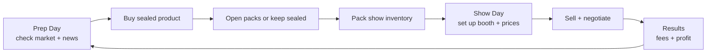
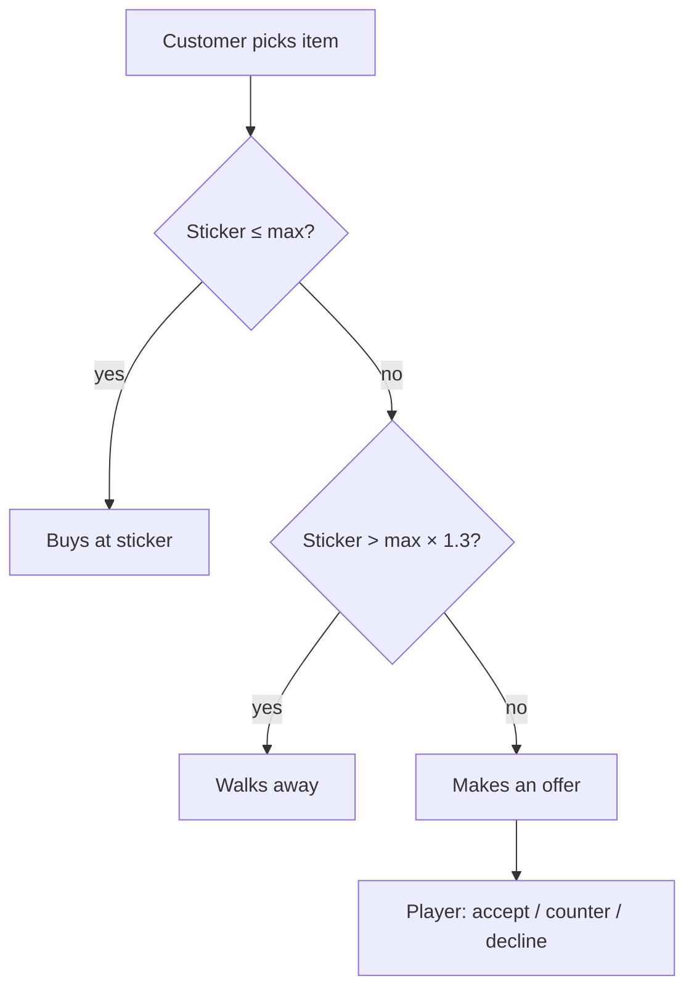

# TCG Card Show Simulator — v1 GDD

Sep 17, 2026 · @Christian Aisle Neral

## Overview

v1 is a solo, single-venue game that proves two things are fun: deciding whether to sell, hold or rip sealed product based on a moving market, and haggling with customers at the booth. Everything else waits until those two feel good.

**Pitch:** You're a new card vendor with $500 and a dream. Watch the market, buy sealed product, rip packs for chase cards, and work the table at weekend card shows to become the richest vendor in the scene.

**Player = the vendor.** The TCG is our own fictional game (working name: *Mythbound*), built to mirror real products: 5-card packs, 6-pack bundles and 36-pack booster boxes.

**What "simple" means for v1:** one venue, two card sets, three sealed products, three customer types, no grading, no card conditions, no co-op. A full run is 20 shows.

**Perspective.** v1 is first person on PC: WASD to move, mouse to look, left click to interact. Anything that can be diegetic is: the CardTrader app runs on the in-game monitor, packs are picked up off a table, booth items are placed by hand. Full-screen overlays are reserved for menus and Results.

## Design pillars

Every v1 feature must serve at least one of these three pillars; anything that doesn't gets cut.

1. **Read the market.** Prices move daily for readable reasons. A player who pays attention should beat one who doesn't.
2. **Rip or hold.** Every sealed item is a real choice. Opening is a thrilling gamble with slightly negative expected value; holding or selling sealed is the steady play.
3. **Work the table.** Selling is a conversation, not a click. Price too high and people walk; cave too fast and you leave money behind.

## v1 scope

v1 ships the full Prep → Show → Results loop at its smallest honest size. Cut features are deferred, not dropped.

| Area | In v1 | Deferred to post-v1 |
| --- | --- | --- |
| View | First person, PC (WASD + mouse, click to interact) | Other platforms |
| Players | Solo (co-op decision still open — see open questions) | Rival booths at the same show |
| Card sets | 2 sets: one in print, one out of print | New set releases mid-run |
| Sealed products | Booster Pack (5 cards), Bundle (6 packs), Box (36 packs) | Elite box, tins, collections |
| Pack contents | 5 slots, defined entirely by a data table | Per-product slot differences, god packs, pity |
| Singles | Near Mint only, raw only | Conditions, grading, slabs |
| Market | Lifecycle trend, daily noise, news events | Player sales affecting price, deeper sim |
| Venues | 1 local show, fixed table fee | Show tiers, travel, calendar choice |
| Customers | 3 archetypes that buy | Whales, players; customers selling to you |
| Booth | Fixed layout: display case, binder, sealed shelf | Upgrades, helpers, card reader |
| Progression | Net worth goal over 20 shows | Reputation, unlocks, leaderboards |
| Persistence | None until F5; one save slot after that | Multiple slots, cloud |

## Core loop

One cycle is two in-game days: a Prep Day at home, then a Show Day at the venue. Market prices update at the start of each day, so they can shift between prep and show.

**Prep Day (untimed).** The player uses the home computer to read prices and news, buy product, and open packs. They then pick which items go in the show case, binder and sealed shelf.

**Show Day (timed, about 8 real minutes).** The player sets sticker prices, the doors open, and customers browse. Sales and negotiations happen until closing.

**Results.** Revenue minus table fee equals the day's profit. Unsold items return home. The run ends after show 20.

## Market system

Every card and sealed product has one market price per day, calculated from a base value and three multipliers. The player reads it on the home computer's *CardTrader* app.

**Formula:** `price(day) = basePrice × trend(day) × eventMult(day) × noise(day)`

- **trend** follows the set's lifecycle. The in-print set drifts slowly down (supply keeps growing). The out-of-print set drifts slowly up.
- **noise** is a daily random walk sized by volatility tier: Low ±1%, Medium ±3%, High ±8%. Commons are Low, chase cards are High.
- **eventMult** comes from news events, which fade back to 1.0 over a few days.

**News events (v1 set).** One event fires roughly every 3 days. Each appears in the news feed on the Prep Day before it moves prices, rewarding players who read it.

| Event | Target | Effect |
| --- | --- | --- |
| Influencer hype | One set's sealed product | +15–30%, fades over 4 days |
| Tournament win | 1–3 specific cards | +20–60%, fades over 5 days |
| Reprint announced | 1 chase card | −20–40%, permanent |
| Restock wave | In-print sealed | −10–15%, fades over 3 days |

**CardTrader app shows:** current price, 7-day change and a sparkline per item, the news feed, and a Rip EV figure per sealed product (expected pull value vs. sealed price). v1 shows Rip EV to everyone; hiding it behind an upgrade is a post-v1 idea.

The simulation uses a seeded RNG so runs can be replayed for debugging and balancing.

## Products and pack opening

v1 has 2 sets × 3 products = 6 sealed items, plus the singles in each set. That is enough for real market decisions without a content burden.

**Sets.** *Set A* ("Mythbound: First Light") is in print: cheaper, easy to buy, slowly declining. *Set B* is out of print: pricier, limited supplier stock each Prep Day, slowly rising. Set A has 34 cards across the seven tiers; Set B's card list is still to be written.

**Rarity ladder** (lowest to highest): Common, Uncommon, Rare, Holographic, Full Art, Alternate Illustration, Special Illustration.

| Tier | Cards per set | Where it appears |
| --- | --- | --- |
| Common | 12 | Slots 1–3 |
| Uncommon | 9 | Slot 4 (90%) |
| Rare | 5 | Slot 4 (10%), slot 5 (60%) |
| Holographic | 3 | Slot 5 (25%) |
| Full Art | 2 | Slot 5 (10.5%) |
| Alternate Illustration | 2 | Slot 5 (4%) |
| Special Illustration | 1 | Slot 5 (0.5%) |

**Pack structure is data, not code.** A pack is an ordered list of slots; each slot holds (tier, integer weight) entries. Slot count is not fixed at 5, and no slot is hard-coded to a tier — any slot can be given any tiers. An editor tool shows the resulting probabilities, validates the table, and simulates N packs using the same code the game and the tests use. The percentages above are the starting configuration, not a rule.

Two live slots matter. If only the final card could ever be rare, four-fifths of every opening is dead air. Slot 4 carries a small chance of Rare so tension starts earlier and slot 5 still lands as the climax.

With the starting table, roughly 15% of packs contain Full Art or better, a 36-pack box has about a 17% chance of at least one Special Illustration, and about a 77% chance of at least one Alternate Illustration. Rolls are independent: no pity timer.

**Pack opening (first person).** The player picks up a pack prop and its cards enter the inventory at that moment. The reveal is presentation only. Five cards appear as a face-down stack and are revealed one at a time in slot order by clicking or swiping the top card aside. Slots 1–3 flip quickly; slots 4 and 5 slow down, and a Rare or better glows in its tier colour before it flips, more strongly from Full Art up. After the last card all five lay out in a row: hovering enlarges a card, clicking lifts it to the centre for a closer look, and the row is dismissed by a Store button or by clicking outside. A quick-open key skips straight to the row for bulk opening. Commons and uncommons go to the bulk box, sold at a fixed price per card.

Within a tier every card is equally likely, and pull rates are identical across products — bigger products just hold more packs at a lower price per pack.

**Cards enter the inventory the moment the pack is opened**, before any animation runs. The reveal is presentation only, so dismissing the view, alt-tabbing or crashing can never lose a pull.

**Opening rule of thumb:** Rip EV should sit at 80–95% of the pack's market price, so opening is a slightly losing bet on average but events and hot cards can flip it positive. This is enforced by an automated test, not a spreadsheet.

## Inventory and booth setup

The booth has a fixed layout with three zones, and slot limits force the player to choose what to bring.

| Zone | Holds | Slots | Who it attracts |
| --- | --- | --- | --- |
| Display case | Full Art and above | 6 | Collectors, Hagglers |
| Binder | Rare and Holographic | 24 | Collectors, Hagglers |
| Sealed shelf | Packs, bundles, boxes | 8 stacks | Kids, Collectors |
| Bulk box | Commons, uncommons | Unlimited | Kids |

**Setting prices.** Each item gets a sticker price. The setup screen shows market price beside it, plus quick buttons for 90%, 100% and 110% of market. A "price all at X% of market" button keeps setup fast.

**Inventory.** One home inventory holds everything the player owns. Items placed in the booth travel to the show; unsold items come back automatically at Results.

## Customers and negotiation

Each customer secretly holds a maximum price for the item they pick up; the whole negotiation is the player trying to land close to it without losing the sale.

### Archetypes

| Archetype | Share of traffic | Wants | Max price (× market) | Patience (rounds) |
| --- | --- | --- | --- | --- |
| Kid + parent | 40% | Packs, bundles, bulk | 1.00–1.15 | 1 |
| Collector | 40% | Rares and up, boxes | 0.95–1.05 | 3 |
| Haggler / flipper | 20% | Anything under market | 0.75–0.88 | 4 |

A show has about 25 customers, arriving in waves. Each browses, picks one item they want, and compares the sticker to their max.

### Decision flow

### Negotiation rules

1. The customer's first offer is 80–90% of their max.
2. The player accepts, declines, or counters with a number.
3. A counter at or under their max is accepted. Above max, they raise their offer 30–50% of the gap toward max and lose one patience.
4. At zero patience they walk. A counter more than 25% above their last offer costs two patience ("that's insulting").
5. Hagglers may say a comp line ("I see it for $X online") where X is the real market price.

The negotiation UI shows the customer's offer, a mood icon for remaining patience, the item's market price and a number input for counters. No hidden reputation in v1.

## End of day and economy

The Results screen answers one question: did today make or lose money? It shows revenue, cost of goods sold, the table fee and net profit, plus the player's net worth.

**Results breakdown**

- **Revenue:** total of every sale today.
- **Cost of goods sold:** what the player paid for sold items (singles pulled from packs carry a share of the pack's cost).
- **Table fee:** flat $60, charged at the end of every show.
- **Net profit:** revenue − cost of goods sold − table fee.
- **Net worth:** cash + inventory at today's market price.

**Win condition.** The run ends after show 20, and the final screen grades net worth (Bronze $2,500, Silver $5,000, Gold $10,000) so every run ends with a score.

**Lose condition.** Bankrupt if the player can't pay the table fee and owns no inventory. Otherwise, unpaid fees are taken from inventory at 70% of market.

## Screens and UI flow

The player walks between a home room and the venue in first person. Most "screens" are surfaces in the world rather than full-screen UI, which is what keeps it feeling like a sim rather than a menu game.

| Surface | Where | Purpose |
| --- | --- | --- |
| Main menu | Full screen | New run, continue, settings |
| CardTrader app | Home monitor (world space) | Prices, 7-day charts, news feed, Rip EV |
| Supplier shop | Home monitor (world space) | Buy sealed product (Set B stock limited) |
| Collection | Home (overlay) | Inventory by tier, quantities, cost basis |
| Pack opening | Home (prop pickup → centred view) | Reveal, then store |
| Booth setup | Venue (place props on the table) | Zones, sticker prices with market shown |
| Show floor | Venue (first person behind the table) | Customers browse and approach |
| Negotiation | World-space panel near the customer | Offer, patience, counter input |
| Results | Full screen at close | Daily breakdown, net worth, next day |

A minimal HUD shows cash, net worth, day number and show count, plus an interaction prompt on whatever the player is looking at.

## Unity technical architecture

Keep all game rules in plain C# classes, separate from MonoBehaviours. It makes the market and negotiation unit-testable now and makes a host-authoritative co-op port far easier later.

**Data (ScriptableObjects)**

| Asset | Key fields |
| --- | --- |
| `CardDefinition` | id, name, set, rarity tier, basePrice, volatilityTier, art |
| `SetDefinition` | id, name, cards, lifecycle (in print / out of print), trend rate |
| `ProductDefinition` | id, set, packCount, basePrice, supplierStockPerDay |
| `PackConfigDefinition` | id, name, price, card set, ordered slots with per-slot (tier, integer weight) entries |
| `TierPriceTable` | base price per rarity tier |
| `RarityPalette` | colour and display name per rarity tier, shared by every card visual and the UI |
| `CustomerArchetype` | traffic share, wants, max-price range, patience |
| `NewsEventDefinition` | target type, effect range, fade days, headline text |

**Runtime services (plain C#)**

- `MarketService`: daily price calculation, event scheduling, seeded RNG, price history.
- `InventoryService`: owned items, cost basis (a pack's cost is split evenly across its cards for now), booth assignment.
- `PackOpener`: for each slot of a pack configuration, rolls a tier from that slot's weights, then picks a card of that tier at random`.`
- `ShowSimulation`: customer spawning, browsing, purchase decisions.
- `NegotiationSession`: one customer's offer/counter state machine.
- `EconomyService`: cash, fees, results, net worth.
- `SaveService`: JSON serialisation of the full run state.

**Game flow.** A `GameStateMachine` drives Home → BoothSetup → ShowFloor → Results. Each state loads its scene or UI and talks to services through a single `GameSession` object, which a `GameBootstrap` creates from the scene's content assets.

**Debug tools from day one:** a console to jump days, add cash, force news events and run 1,000 simulated pack openings to check Rip EV.

**Assemblies.** `Game.Core` (no engine references, deterministic, seeded), `Game.Unity` (MonoBehaviours, ScriptableObjects, UI — presentation and input, never rules), `Game.Core.Tests` (EditMode), plus an editor-only assembly for tooling that must never ship in a build.

**Code standards.** `Docs/CODING_STANDARDS.md` is the reference, with the non-negotiables repeated in `CLAUDE.md`. Patterns are decided up front rather than left to taste: Observer via plain C# events on Core services; State for the game flow, negotiation and customer AI; Flyweight via ScriptableObject definitions with runtime instances holding only an id plus mutable state; Object Pool via `UnityEngine.Pool` for customers and card visuals; the game loop is Unity's, so no rules run in `Update`. Command is deferred until there is a reason (transaction log, undo, networking). Singletons are banned — hidden global state, untestable code, and Play Mode domain reload is disabled, so statics do not reset.

**Editor tooling.** Two tools carry their weight from the first milestone: a pack configuration window (validates the slot table, shows per-slot and per-pack odds, simulates N packs and reports Rip EV, all through the same Core code as the game and the tests), and a prototype card data generator (idempotent, seeded names, builds the card pool, tier materials, props and the card UI template from one shared palette asset).

**Persistence.** There is no `SaveService` until F5. Core state types stay serialisation-friendly from the start — plain fields, no engine types, no behaviour in the data — so adding it later is a small job. Pull it forward if friends playtest and want to keep a collection between sessions, or if balance testing needs a long-running save.

## Starting balance numbers

These are first-guess values meant to be tuned in playtests. Set A's numbers are the ones in the data, and its Rip EV is verified by test at about 85% of pack price. Set B's values are derived by scaling Set A by 1.8, and still need to be authored and checked.

**Economy:** starting cash $500, table fee $60, 25 customers per show, 20 shows per run.

**Sealed product (base market price, USD)**

| Product | Set A (in print) | Set B (out of print) | Supplier price |
| --- | --- | --- | --- |
| Booster Pack (5 cards) | $4.25 | $7.65 | A: 90% of market, B: 100% |
| Booster Bundle (6 packs) | $24 | $43 | A: 90% of market, B: 100% |
| Booster Box (36 packs) | $135 | $248 | A: 90% of market, B: 100% |

Set A's supplier discount gives a small, safe margin on sealed resale. Set B has no discount, so its profit comes from holding while prices rise. Bigger products cost less per pack, which is the reason to buy them.

**Average card value by tier.** Money is stored as integer cents everywhere in code; dollars are shown here for readability.

| Tier | Set A | Set B |
| --- | --- | --- |
| Common | $0.05 | $0.09 |
| Uncommon | $0.15 | $0.27 |
| Rare | $0.60 | $1.08 |
| Holographic | $2.50 | $4.50 |
| Full Art | $8 | $14.40 |
| Alternate Illustration | $25 | $45 |
| Special Illustration | $90 | $162 |

**Rip EV check (Set A pack):** slots 1–3 $0.15 + slot 4 $0.20 + slot 5 $3.28 = about $3.62, or 85% of the $4.25 pack. Set B is scaled by 1.8 throughout, so it lands at the same ratio.

**Bulk box:** commons and uncommons sell at a fixed $0.10 each, mostly to kids.

## Art direction and assets

The look is flat-colour, untextured low poly, in the vein of the co-op sims this sits next to (Peak, Gamble With Your Friends): simple shapes, readable at a glance, warm lighting. Nothing is textured except card faces. One shared palette asset (8–12 colours) drives every material, UI accent and rarity tell, so parts from different sources still read as one game.

| Need | First-pass source |
| --- | --- |
| Players and customers | Quaternius Ultimate Modular Men + Women (CC0, 21 characters, swappable parts) |
| Animations | Quaternius Universal Animation Library (CC0, humanoid, retargetable) |
| Home interior | Quaternius Ultimate House Interior + Furniture packs (CC0) |
| Venue hall, tables, sealed product | ProBuilder primitives with flat materials |
| First-person controller | Unity Starter Assets (Input System) |
| UI | UI Toolkit with flat USS styling — no sprite kits, nothing that reads as mobile |
| Icons and fonts | Phosphor Icons (MIT); Google Fonts — a clean sans plus a mono for CardTrader |

**Card faces.** One master frame layout with seven tier treatments, escalating structurally rather than by colour alone: Common and Uncommon are flat panels with a thin border; Rare and Holographic add a two-tone frame; Full Art drops the border and goes edge-to-edge; Alternate Illustration adds grain and a different composition; Special Illustration is full-bleed foil with an ornate frame. Higher tiers change the card's silhouette, so the tier reads before any text does.

**Foil** comes later as a Shader Graph pass (rainbow generated in-shader, masked so the card stays readable), not as authored textures. Until then, tier colour plus text is enough.

Placeholder art is generated, not drawn: an editor tool builds the card pool, tier materials, props and the card UI template from the palette, so F1b has real content to display without an art pass.

## Milestones

Build in slices that each end in something playable. The original plan built the market first; it was reordered so the core loop is provable early and the market arrives once there is something for prices to act on.

| # | Milestone | Done when |
| --- | --- | --- |
| M0 | Skeleton + first-person controls | Assemblies and seeded RNG in place; walk and look in a greybox room, no console errors |
| F1a | Pack rules, inventory, config tool | Data-driven slot table, seeded roller, cost basis, EditMode tests green, editor simulation reports Rip EV |
| F1-assets | Placeholder card content | One command generates the card pool, tier materials, props and card UI template; re-running changes nothing |
| F1b | Pack opening experience | Pick up a pack, reveal five cards, store them, see them in the collection |
| F2 | Booth setup + selling | Place items, set sticker prices, customers walk up and buy at sticker; table fee and Results close the day |
| F3 | Negotiation | Offer/counter/patience works across the three archetypes |
| F4 | Market + news | Lifecycle trends, news events, CardTrader app with charts and Rip EV |
| F5 | Run structure | Save/load, 20-show run, win/lose grading, balance pass |

F1a through F1b is the first vertical slice: buy nothing, sell nothing, just rip and keep. After F2 there is a complete day. After F3 the game has its personality, and that is the moment to hand it to friends and ask: "Did you want to play one more show?"

Work is tracked as GitHub issues, one milestone per row above, on a board with Backlog → Ready → In progress → In review → Done.

## Post-v1 roadmap and open questions

The next features, in suggested order, add depth to the loop v1 proves.

1. **Buying from customers:** customers bring cards to sell; the player offers a % of market.
2. **Show tiers + calendar:** local, regional and convention shows with different fees, traffic and whales.
3. **Booth upgrades + reputation:** more slots, a card reader, repeat customers.
4. **Grading and conditions:** send hits off for grades that multiply value.
5. **New set releases:** hype spikes, cooldowns and sets going out of print mid-run.
6. **Co-op:** shared empire first, then rival booths at the same show.

**Open questions**

- [ ] Working title, and the name of the fictional TCG (working: *Mythbound*)
- [ ] **Co-op: decide before F2.** If shared-booth co-op is the real fantasy, networking should land right after F1b; retrofitting it once the systems multiply is the expensive path
- [ ] Prep days per show: one, or several days between shows so market-watching matters more?
- [ ] Foil effect: reactive to camera and mouse movement, or auto-loop? Affects how the card view is wired
- [ ] Is 20 shows the right run length, or should v1 be endless with a score?
- [ ] Target platform: PC (Steam) only for v1?
- [ ] Set B: write the 34-card list, author its tier values (currently a ×1.8 scale of Set A) and run its own Rip EV check
- [ ] Volatility tiers under the seven-tier ladder: which tiers are Low, Medium and High?

## Changelog

### v1.5 (2026-09-27)

- Added the v1.5 updates section at the end of the document: Prep Night replaces Prep Day (fixed 10:00 PM clock); the binder inventory (prototype) replaces the Collection overlay; the UI kit's tier colours map onto the seven tiers, which stay as they are; vendor level and XP recorded as up for discussion, not in scope.
- File renamed to `Docs/GDDv1.5.md`.

### v1.2 (2026-09-28)

Merged the repo copy (v1.1, reviewed through cd18c8e) with the design revisions made here, so this doc is the single source of truth again.

- From the implementation: Set A named "Mythbound: First Light" with 34 cards; pack opening flow as built (cards owned at pickup, click or swipe reveal, tier glow from Rare up, row with hover-enlarge and click-to-inspect, quick-open key); `PackConfigDefinition`, `TierPriceTable` and `RarityPalette` assets; `PackOpener` rolls a tier per slot then a card within it; `InventoryService` splits a pack's cost evenly across its cards; `GameBootstrap` creates the `GameSession`.
- Resolved open questions: home presentation is first person (scope table, Perspective note and Screens section all reflect it); Bundle and Box repriced around the $4.25 pack ($24 and $135 for Set A); display case holds Full Art and above, binder holds Rare and Holographic.
- Carried forward as open: Set B's card list, tier values and its own Rip EV check; volatility tiers under the seven-tier ladder.
- Kept from the design pass: first-person perspective, art direction and assets, the M0 → F1a → F1-assets → F1b → F2–F5 milestones, code standards and pattern decisions, editor tooling, and the persistence plan.

### v1.1 (2026-09-27)

Written from the implementation, reviewed through cd18c8e.

- Packs are 5 cards, not 10; seven rarity tiers replace the old five-rarity table; per-slot weights configured in data.
- Set A pack price $4.25 and tier base values from the tier price table; Rip EV recomputed at 85.2%.
- Architecture updated to the assets and services as built.

## v1.5 updates

Added with the UI kit handoff. They sit here at the end for now and have not been folded into the sections above; where they disagree with an earlier section, this section wins.

### Prep Night

The home half of each cycle is a **Prep Night**, not a Prep Day: the player preps the evening before the show. The clock is fixed at 10:00 PM and does not run, so prep stays untimed. The HUD's day readout shows "Day {n}" with either "Prep Night" or "Show Day". Wherever the sections above say Prep Day (core loop, news events, Set B supplier stock), read Prep Night.

### Binder inventory (prototype)

The inventory view is a physical card binder. It replaces the "Collection" overlay in the Screens and UI flow table, and the plain inventory list built in F1b. It is a prototype, built to be replaced rather than extended.

- Full screen over a dimmed backdrop, opened and closed with Tab.
- Two facing pages of 3 × 3 pockets. A pocket shows the card and its copy count only (no prices, no stats); an empty pocket is marked as empty.
- Tabs on the binder's edge: Set A, Set B, Sealed, Bulk, each with a count.
- Keys: A/D turn pages, Q/E switch tabs, Enter opens card details, Tab closes.
- Card details (stats, 7-day price line) are a separate screen, outside the prototype.

The full spec is in `Docs/UI/UI_STYLE_GUIDE.md` §8.

### Rarity and the UI kit

The seven tiers above stay as they are. The UI kit numbers its tier colours 1 to 7 (`--color-tier-1` to `--color-tier-7`), and they map in order: Common, Uncommon, Rare, Holographic, Full Art, Alternate Illustration, Special Illustration. The kit's own tier names (Super Rare, Ultra Rare, Secret Rare, Mythic) are not used.

- [ ] Which is the source of tier colours: the `RarityPalette` asset (world materials and the current card visuals) or the UI kit's tier tokens? Today they hold different values.

### Up for discussion: vendor level and XP

Not a current focus, and not in v1 scope yet. The HUD mockups show a vendor level: a level badge, an XP count and bar, "+XP" gains and a level-up moment. Until it is decided, progression stays the 20-show net-worth goal.

- [ ] What earns XP (for example sales, negotiations won, shows completed)?
- [ ] What does a level do (for example unlocks, booth slots, customer traffic)?
